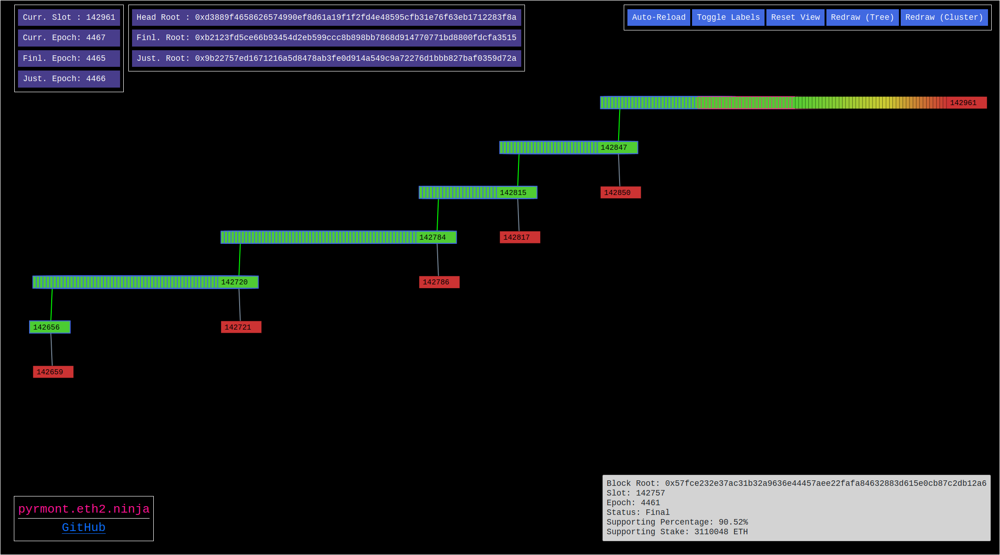

# Eth2.0 Fork Choice Visualizer

This is an Eth2.0 fork choice visualizer that plots data from a [Lighthouse](https://github.com/sigp/lighthouse) beacon node's [`/lighthouse/proto_array`](https://lighthouse-book.sigmaprime.io/api-lighthouse.html) HTTP endpoint.

A live demo is available at [eth2.ninja](http://eth2.ninja).



## Deployment
To deploy this server locally to serve at [http://localhost](http://localhost):
1. Fill in the following fields in `config.yml`:
    - `eth2_api`: Lighthouse beacon node's HTTP endpoint
    - [Optional] `page_title`: Page title for the webpage
    - [Optional] `graffiti`: Small graffiti string to be included at the bottom left of the webpage
    - [Optional] `uwsgi`: Custom deployment options to pass to the `uwsgi` webserver
2. Build the Docker images using:
      ```
      docker-compose build
      ```
3. Deploy the websever using:
      ```
      docker-compose up
      ```


## User Guide

### Colors
The various colors in the graph can be interpreted using the following guide:

**Tree Link Color (Canonical Chain)**:
- Green Link: Canonical chain
- Gray Link: Non-canonical chain

**Border Stroke Color (Fin./Just. Chain)**:
- Blue Border: Finalized chain
- Pink Border: Best Justified chain

**Node Fill Color (Supporting Stake)**:

The fill color is a gradient with the two extreme ends being:
- Green Fill: High percentage of stake in support of block
- Red Fill: Low percentage of stake in support of block
